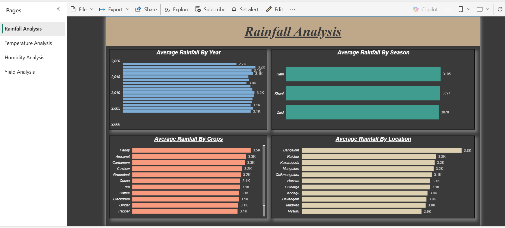

# Agriculture Data Analysis (Power BI Dashboard)

## Project Overview
This project involves analyzing agricultural data using **Power BI** to visualize key insights related to rainfall, temperature, humidity, and crop yield. The dashboard provides interactive and data-driven insights to help stakeholders make informed decisions about agricultural practices.

## Features
- **Rainfall Analysis**: Insights into rainfall trends by year, season, location, and crop type.
- **Temperature Analysis**: Impact of temperature variations on agricultural productivity.
- **Humidity Analysis**: Understanding how humidity affects crop growth and soil conditions.
- **Yield Analysis**: Predictive insights on crop yield based on environmental factors.
- **Interactive Dashboard**: User-friendly, customizable visualizations with filters and drill-down capabilities.

## Tools & Technologies Used
- **Data Visualization**: Power BI
- **Data Processing**: Power Query
- **Data Sources**: CSV, Excel, SQL Databases, APIs
- **Data Modeling**: Relationships, DAX Measures, Calculated Columns

## Data Sources
- Government agricultural reports
- Weather monitoring agencies
- Open-source datasets on crop production and climate conditions

## Installation & Usage
1. Download the **Power BI Dashboard file (.pbix)** from the repository.
2. Open it in **Microsoft Power BI Desktop**.
3. Connect to the dataset (CSV/SQL) if necessary.
4. Use filters to explore insights based on different parameters.
5. Publish the report to **Power BI Service** for online access and sharing.

## Example Dashboard Screenshot

## Future Enhancements
- Integration with **live weather APIs** for real-time analysis.
- AI-based predictive analytics for yield forecasting.
- Embedding dashboards in web applications for wider accessibility.

## Contribution
Contributions are welcome! Fork the repository and submit pull requests with improvements.

---
**Author**: Lokesh Bapte  
**GitHub**: [lokesh182](https://github.com/lokesh182)  
**LinkedIn**: [lokesh182](https://linkedin.com/in/lokesh182)
